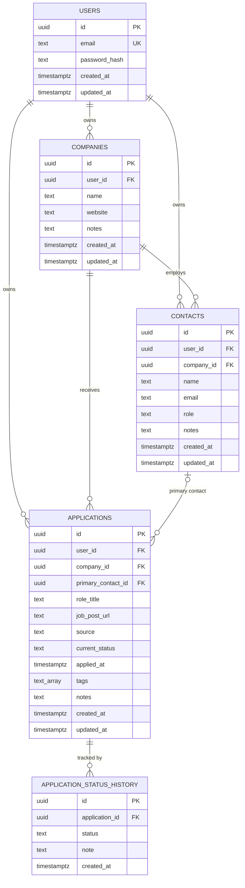

# JAT v1 Schema

See `src/db/schema.ts` for the source of truth (Drizzle). See `drizzle/` for the generated SQL migrations.

## Entities

| Table                        | Purpose                                                 |
| ---------------------------- | ------------------------------------------------------- |
| `users`                      | Account holders. One per signup.                        |
| `companies`                  | Organizations the user has applied to or is tracking.   |
| `contacts`                   | People at companies (recruiters, hiring managers, ICs). |
| `applications`               | A specific role applied to at a specific company.       |
| `application_status_history` | Append-only log of status changes per application.      |

## Conventions

- All primary keys are UUIDv7 generated in the application layer.
- All timestamps are `timestamp with time zone` (Postgres `timestamptz`).
- All owned tables carry `user_id` for fast tenant filtering.
- `created_at` defaults to `now()`. `updated_at` is maintained by Drizzle's `$onUpdate`.

See the **Decision log** in the main README for rationale on schema-level choices.
